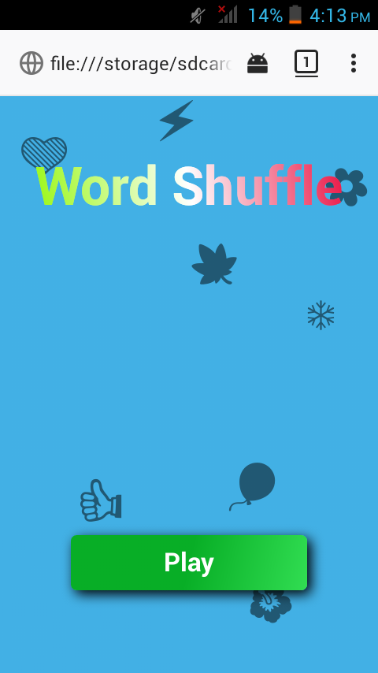
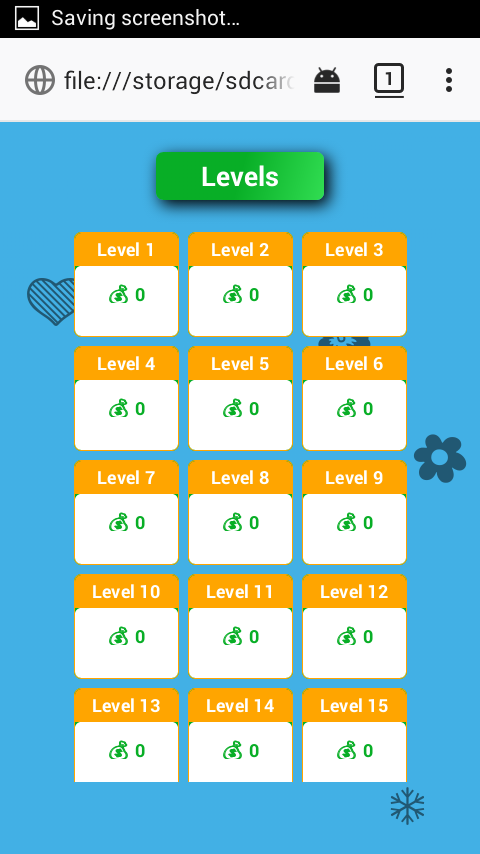
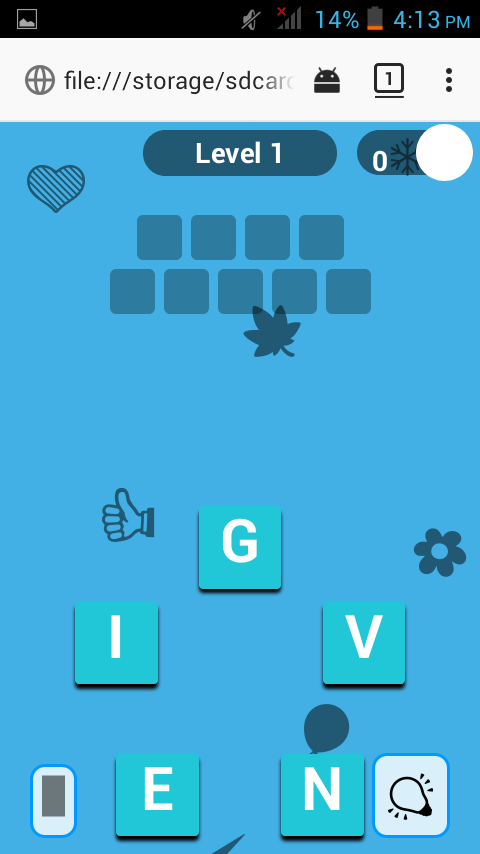
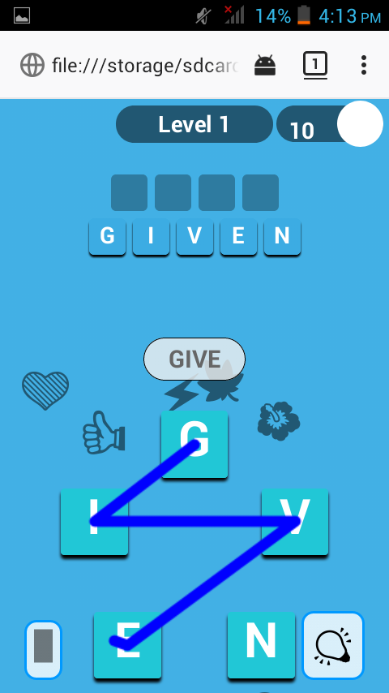
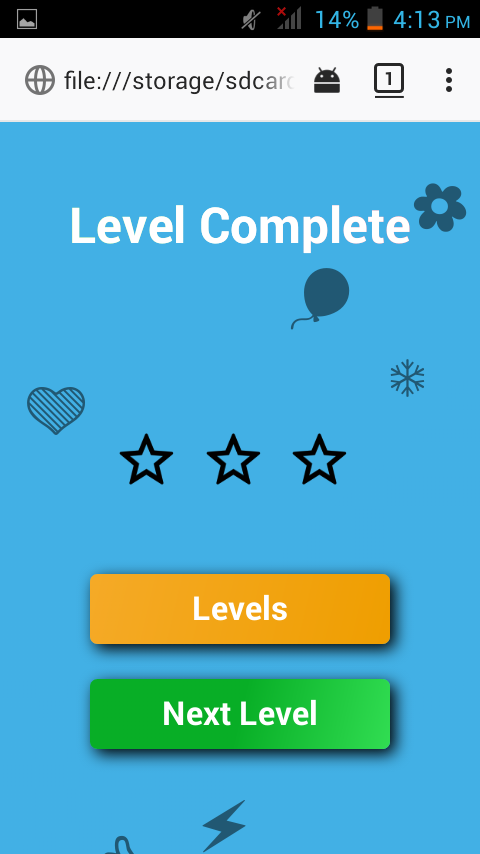

# WordShuffleGame
<html>
<head>
    <meta charset="UTF-8">
</head>
<body>
    <h3>This is a simple but too hard offline Word Shuffle game</h3>
    <h4>It can perform these features;</h4>
    <b>
    <ol>
    <li>I has 52levels</li>
    <li>Offline Game</li>
    <li>Each level you have to given hard words</li>
    <li>This game levels has unlocked for all</li>
    </ol>
   <h3> Languages used </h3>
   <ul>
   <li>Html</li>
   <li>Css</li>
   <li>Javascript</li>
   </ul>
   <h4>You can find the demo <a href="https://wordshuffle.netlify.app">here</a></h4>
   <h3>There are some screenshots please see</h3>
   </img>
    
   </img>
    
   </img>
    
   </img>
    
   </img>
</body>
</html>
